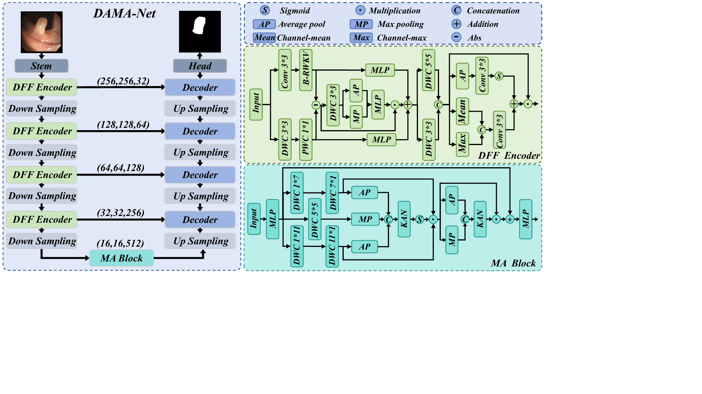

# DAMA-Net

This repository presents **DAMA-Net: Discrepancy-Aware Feature Fusion and Multi-Scale Aggregation Network for Polyp Segmentation**.

DAMA-Net is a lightweight U-shaped network for robust polyp segmentation. It combines convolutional local representations with bidirectional RWKV contextual features through discrepancy-aware fusion, then strengthens bottleneck semantics with adaptive multi-scale aggregation.



## News

- The manuscript and visual materials are organized for public project presentation.
- Code and pretrained weights will be released after the paper review/release process.

## Key Ideas

- **Discrepancy-aware feature fusion (DFF).** Local convolutional features and bidirectional RWKV contextual features are compared through an absolute discrepancy map. The discrepancy map generates adaptive fusion weights for local-global feature integration.
- **Multi-scale aggregation (MA).** The bottleneck aggregates asymmetric and square depthwise convolution branches, then uses adaptive weighting to recalibrate multi-scale context.
- **Efficient accuracy-complexity trade-off.** DAMA-Net reports 7.29M parameters and 10.81G FLOPs while reaching 92.7% average Dice and 86.1% average IoU across four public polyp datasets.

## Method Overview

The network contains four main parts:

- A lightweight stem that extracts initial image features.
- Four DFF encoder stages for adaptive local-global feature interaction.
- An MA bottleneck block for multi-scale contextual aggregation.
- A U-shaped decoder that restores the segmentation mask with skip connections.

More details are available in [docs/METHOD.md](docs/METHOD.md).

## Quantitative Results

Dice and IoU are reported in percentage.

| Model | CVC-300 Dice | CVC-300 IoU | ClinicDB Dice | ClinicDB IoU | ETIS Dice | ETIS IoU | Kvasir-SEG Dice | Kvasir-SEG IoU |
|---|---:|---:|---:|---:|---:|---:|---:|---:|
| PraNet | 88.1 | 78.7 | 92.7 | 86.4 | 87.6 | 78.0 | 84.2 | 72.8 |
| nnUNet | 84.8 | 73.6 | 93.0 | 87.0 | 88.0 | 81.6 | 81.5 | 68.8 |
| TransUNet | 91.5 | 83.9 | 92.7 | 86.4 | 89.7 | 81.3 | 70.1 | 54.0 |
| PVT-EMCAD | 89.8 | 81.4 | 93.0 | 86.9 | 90.2 | 82.2 | 84.1 | 72.5 |
| H2Former | 69.7 | 53.5 | 89.9 | 81.7 | 79.1 | 65.4 | 83.6 | 71.8 |
| U-KAN | 91.6 | 84.7 | 90.5 | 82.6 | 90.3 | 82.3 | 84.8 | 73.6 |
| U-RWKV | 87.7 | 78.1 | 91.0 | 83.4 | 90.1 | 82.0 | 83.9 | 72.3 |
| **DAMA-Net** | **93.4** | **87.6** | **96.3** | **91.0** | **94.7** | **90.0** | **86.2** | **75.7** |

More result tables are available in [docs/RESULTS.md](docs/RESULTS.md).


## Complexity

| Method | Params (M) | FLOPs (G) | Avg Dice | Avg IoU |
|---|---:|---:|---:|---:|
| PraNet | 30.50 | 13.77 | 88.2 | 79.0 |
| nnUNet | 7.85 | 27.90 | 76.8 | 65.3 |
| TransUNet | 105.32 | 76.78 | 86.0 | 76.4 |
| PVT-EMCAD | 26.76 | 11.59 | 89.3 | 80.8 |
| H2Former | 33.69 | 64.81 | 80.6 | 68.1 |
| U-KAN | 25.35 | 21.16 | 89.3 | 80.8 |
| U-RWKV | 14.86 | 43.54 | 88.2 | 79.0 |
| **DAMA-Net** | **7.29** | **10.81** | **92.7** | **86.1** |

## Ablation Study

| Base | DFF | MA | Params (M) | FLOPs (G) | CVC-300 Dice | CVC-300 IoU | ETIS Dice | ETIS IoU | Avg Dice | Avg IoU |
|---:|---:|---:|---:|---:|---:|---:|---:|---:|---:|---:|
| yes | no | no | 14.86 | 43.54 | 87.7 | 78.1 | 90.1 | 82.0 | 88.9 | 80.1 |
| yes | yes | no | 9.49 | 30.50 | 90.9 | 83.2 | 91.6 | 83.7 | 91.3 | 83.5 |
| yes | yes | yes | 7.29 | 10.81 | 93.4 | 87.6 | 94.7 | 90.0 | 94.1 | 88.8 |

## Experimental Protocol

The experiments use four public polyp segmentation datasets: CVC-300, CVC-ClinicDB, ETIS, and Kvasir-SEG. Images are resized to 256x256, each dataset is split into training/validation/test subsets with an 8:1:1 ratio, and all compared methods are trained under the same settings. Further details are summarized in [docs/REPRODUCIBILITY.md](docs/REPRODUCIBILITY.md) and [docs/DATASETS.md](docs/DATASETS.md).

## Repository Structure

```text
assets/figures/       Architecture and qualitative result figures
assets/tables/        CSV copies of reported quantitative tables
docs/                 Method, results, dataset, and reproducibility notes in Markdown
paper/                Manuscript PDF
```

## Citation

```bibtex
@inproceedings{damanet2027,
  title={DAMA-Net: Discrepancy-Aware Feature Fusion and Multi-Scale Aggregation Network for Polyp Segmentation},
  author={Wang, Hongze and Zhang, Yuqi and Ma, Lanxiang and Guo, Yu and Ma, Jiquan},
  booktitle={ICASSP},
  year={2027}
}
```

## Notes

This repository is prepared from the manuscript materials and is currently focused on paper presentation. Implementation code and pretrained weights will be added after the final decision of ICASSP2027.
