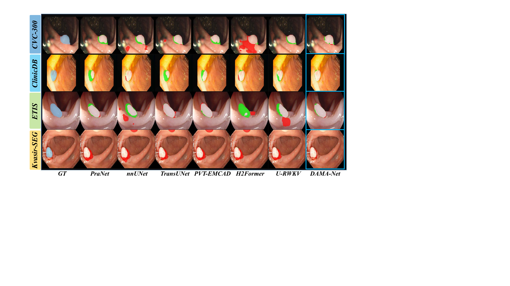
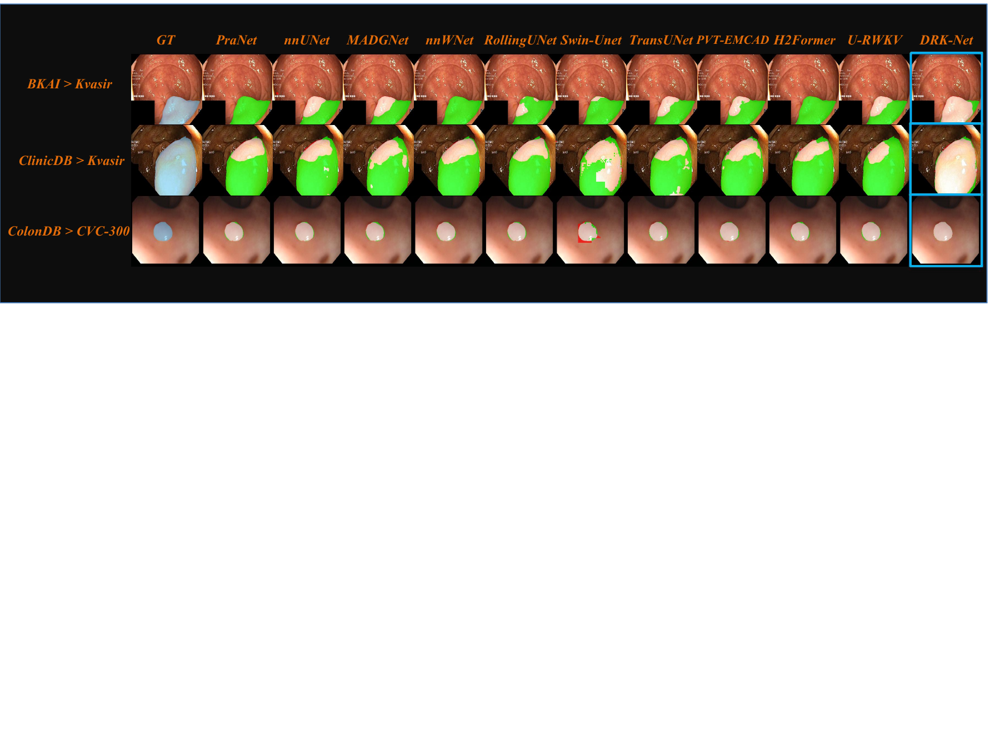

# Results

## Main Comparison

| Model | CVC-300 Dice | CVC-300 IoU | ClinicDB Dice | ClinicDB IoU | ETIS Dice | ETIS IoU | Kvasir-SEG Dice | Kvasir-SEG IoU | p-value |
|---|---:|---:|---:|---:|---:|---:|---:|---:|---:|
| PraNet | 88.1 | 78.7 | 92.7 | 86.4 | 87.6 | 78.0 | 84.2 | 72.8 | 4e-6 |
| nnUNet | 84.8 | 73.6 | 93.0 | 87.0 | 88.0 | 81.6 | 81.5 | 68.8 | 1e-6 |
| TransUNet | 91.5 | 83.9 | 92.7 | 86.4 | 89.7 | 81.3 | 70.1 | 54.0 | 2e-4 |
| PVT-EMCAD | 89.8 | 81.4 | 93.0 | 86.9 | 90.2 | 82.2 | 84.1 | 72.5 | 7e-5 |
| H2Former | 69.7 | 53.5 | 89.9 | 81.7 | 79.1 | 65.4 | 83.6 | 71.8 | 2e-15 |
| U-KAN | 91.6 | 84.7 | 90.5 | 82.6 | 90.3 | 82.3 | 84.8 | 73.6 | 7e-8 |
| U-RWKV | 87.7 | 78.1 | 91.0 | 83.4 | 90.1 | 82.0 | 83.9 | 72.3 | 4e-6 |
| DAMA-Net | 93.4 | 87.6 | 96.3 | 91.0 | 94.7 | 90.0 | 86.2 | 75.7 | - |

## Complexity

| Method | Params (M) | FLOPs (G) | Avg Dice | Avg IoU |
|---|---:|---:|---:|---:|
| PraNet | 30.50 | 13.77 | 88.2 | 79.0 |
| nnUNet | 7.85 | 27.90 | 76.8 | 65.3 |
| TransUNet | 105.32 | 76.78 | 86.0 | 76.4 |
| PVT-EMCAD | 26.76 | 11.59 | 89.3 | 80.8 |
| H2Former | 33.69 | 64.81 | 80.6 | 68.1 |
| U-KAN | 25.35 | 21.16 | 89.3 | 80.8 |
| U-RWKV | 14.86 | 43.54 | 88.2 | 79.0 |
| DAMA-Net | 7.29 | 10.81 | 92.7 | 86.1 |

## Ablation

| Base | DFF | MA | Params (M) | FLOPs (G) | CVC-300 Dice | CVC-300 IoU | ETIS Dice | ETIS IoU | Avg Dice | Avg IoU |
|---:|---:|---:|---:|---:|---:|---:|---:|---:|---:|---:|
| yes | no | no | 14.86 | 43.54 | 87.7 | 78.1 | 90.1 | 82.0 | 88.9 | 80.1 |
| yes | yes | no | 9.49 | 30.50 | 90.9 | 83.2 | 91.6 | 83.7 | 91.3 | 83.5 |
| yes | yes | yes | 7.29 | 10.81 | 93.4 | 87.6 | 94.7 | 90.0 | 94.1 | 88.8 |

## Qualitative Comparison

## Cross-Dataset Visualization

